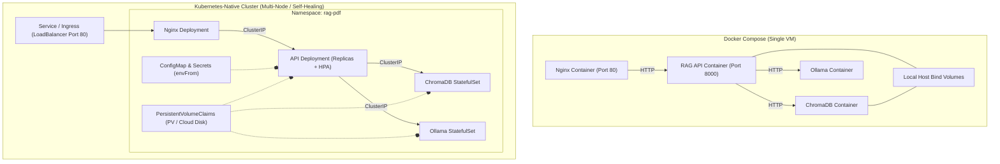

# 🚀 From Docker Compose to Kubernetes-Native: The 5-Part Mastery Guide

Welcome to your complete **Kubernetes-Native (K8s) Mastery Curriculum** tailored specifically for the **RAG-PDF** project! 

Transitioning from Docker Compose (`docker-compose.prod.yml`) to Kubernetes is a major leap in cloud-native software engineering. While Docker Compose is fantastic for running containers on a single virtual machine, **Kubernetes orchestrates clusters of machines**, providing enterprise-grade self-healing, automated scaling, rolling zero-downtime updates, and declarative infrastructure.

---

## 🏛️ Architectural Comparison: Docker Compose vs. Kubernetes



We have organized your repository into a production-grade Kubernetes directory structure under [`k8s/`](file:///a:/Github%20Repos/Rag-pdf/Rag-pdf/k8s). Here is your structured 5-part journey to master Kubernetes while building your practical environment!

---

## 📦 Part 1: The Foundation — Namespaces, Pods & Deployments

### 💡 Core Concept
In Docker Compose, containers run in a flat space on your machine. In Kubernetes:
* **Namespace**: A virtual isolation boundary (a cluster within a cluster). We create `rag-pdf` so all your services, configs, and storage stay organized and isolated from other projects.
* **Pod**: The smallest deployable unit in Kubernetes. A pod wraps one or more containers (like our Python API or Nginx) and shares storage and networking.
* **Deployment**: The controller that manages Pods. If a Pod crashes or its underlying server dies, the Deployment controller automatically spins up a new replacement in milliseconds!

### 🛠️ Practical Implementation in RAG-PDF
We have translated your Nginx and basic API services from `docker-compose.prod.yml` into declarative Deployments with defined CPU and Memory requests and limits.

| File Path | Description | Key K8s Feature Taught |
| :--- | :--- | :--- |
| [`k8s/01-foundation/01-namespace.yaml`](file:///a:/Github%20Repos/Rag-pdf/Rag-pdf/k8s/01-foundation/01-namespace.yaml) | Creates the virtual workspace | `kind: Namespace`, metadata labels |
| [`k8s/01-foundation/02-nginx-deployment.yaml`](file:///a:/Github%20Repos/Rag-pdf/Rag-pdf/k8s/01-foundation/02-nginx-deployment.yaml) | Stateless gateway with 2 replicas | `replicas`, `selector`, `resources.limits` |
| [`k8s/01-foundation/03-api-deployment-basic.yaml`](file:///a:/Github%20Repos/Rag-pdf/Rag-pdf/k8s/01-foundation/03-api-deployment-basic.yaml) | Foundational RAG API deployment | Container specifications & basic envs |

### 🚀 Hands-On Practice
Run the following commands in your terminal to apply Part 1 and verify your pods:
```powershell
# 1. Create the namespace
kubectl apply -f k8s/01-foundation/01-namespace.yaml

# 2. Deploy Nginx and the foundational API
kubectl apply -f k8s/01-foundation/02-nginx-deployment.yaml
kubectl apply -f k8s/01-foundation/03-api-deployment-basic.yaml

# 3. Watch your pods spin up in real-time!
kubectl get pods -n rag-pdf -o wide
```

---

## 🌐 Part 2: Networking & Communication — Services & Ingress

### 💡 Core Concept
In Docker Compose, you refer to other containers by their service name (e.g., `http://chromadb:8000`). In Kubernetes, Pod IP addresses change every time a pod scales or restarts! To solve this, Kubernetes uses **Services**:
* **ClusterIP**: Creates a permanent, internal-only virtual IP and DNS name inside the cluster (`http://rag-api.rag-pdf.svc.cluster.local:8000`).
* **LoadBalancer / NodePort**: Exposes a service to the outside world (your users).
* **Ingress**: A powerful Kubernetes-native HTTP load balancer that can completely replace custom Nginx proxy containers by managing routing, SSL termination, and timeouts declaratively!

### 🛠️ Practical Implementation in RAG-PDF
We created ClusterIP services for internal communication between your API, ChromaDB, and Ollama, and exposed Nginx using a LoadBalancer.

| File Path | Description | Key K8s Feature Taught |
| :--- | :--- | :--- |
| [`k8s/02-networking/01-api-service.yaml`](file:///a:/Github%20Repos/Rag-pdf/Rag-pdf/k8s/02-networking/01-api-service.yaml) | Internal networking for Python backend | `type: ClusterIP`, port mapping |
| [`k8s/02-networking/02-chromadb-service.yaml`](file:///a:/Github%20Repos/Rag-pdf/Rag-pdf/k8s/02-networking/02-chromadb-service.yaml) | Internal vector DB networking | Stable DNS resolution for databases |
| [`k8s/02-networking/03-ollama-service.yaml`](file:///a:/Github%20Repos/Rag-pdf/Rag-pdf/k8s/02-networking/03-ollama-service.yaml) | Internal LLM inference networking | Port `11434` exposure |
| [`k8s/02-networking/04-nginx-service.yaml`](file:///a:/Github%20Repos/Rag-pdf/Rag-pdf/k8s/02-networking/04-nginx-service.yaml) | Public gateway exposure | `type: LoadBalancer` |
| [`k8s/02-networking/05-ingress.yaml`](file:///a:/Github%20Repos/Rag-pdf/Rag-pdf/k8s/02-networking/05-ingress.yaml) | Native Kubernetes Ingress | Replacing Nginx with K8s Ingress rules |

### 🚀 Hands-On Practice
```powershell
# 1. Apply all internal and external networking services
kubectl apply -f k8s/02-networking/

# 2. Check the DNS names and assigned IPs of your services
kubectl get svc -n rag-pdf

# 3. Test internal DNS resolution inside a pod (DNS proof of concept!)
kubectl exec -it deploy/rag-nginx-deployment -n rag-pdf -- nslookup rag-api
```

---

## 🔐 Part 3: Configuration & Secret Management — ConfigMaps & Secrets

### 💡 Core Concept
In Docker Compose, you use `.env` files. In Kubernetes, hardcoding variables into container specs violates the Twelve-Factor App methodology. If you want to switch from `EMBEDDING_PROVIDER=local` to `gemini`, you shouldn't need to rebuild or reapply Pod manifests!
* **ConfigMap**: Stores non-sensitive application settings (model names, timeouts, ports).
* **Secret**: Stores sensitive credentials (like `GEMINI_API_KEY` or `PINECONE_API_KEY`) encrypted/base64-encoded in the cluster cluster store.
* **`envFrom`**: An elegant Kubernetes directive that injects *all* keys from a ConfigMap and Secret directly into your container as environment variables in one line!

### 🛠️ Practical Implementation in RAG-PDF
We decoupled your entire `.env.example` file into clean Kubernetes primitives.

| File Path | Description | Key K8s Feature Taught |
| :--- | :--- | :--- |
| [`k8s/03-configuration/01-configmap.yaml`](file:///a:/Github%20Repos/Rag-pdf/Rag-pdf/k8s/03-configuration/01-configmap.yaml) | All 20+ non-sensitive RAG settings | `kind: ConfigMap`, key-value data structures |
| [`k8s/03-configuration/02-secret.yaml`](file:///a:/Github%20Repos/Rag-pdf/Rag-pdf/k8s/03-configuration/02-secret.yaml) | API Keys for Gemini & Pinecone | `kind: Secret`, `stringData` auto-encoding |
| [`k8s/03-configuration/03-api-deployment-with-config.yaml`](file:///a:/Github%20Repos/Rag-pdf/Rag-pdf/k8s/03-configuration/03-api-deployment-with-config.yaml) | API deployment injecting configs | `envFrom`, `configMapRef`, `secretRef` |

### 🚀 Hands-On Practice
```powershell
# 1. Apply your ConfigMap and Secrets
kubectl apply -f k8s/03-configuration/01-configmap.yaml
kubectl apply -f k8s/03-configuration/02-secret.yaml

# 2. Deploy the upgraded API pod that uses envFrom
kubectl apply -f k8s/03-configuration/03-api-deployment-with-config.yaml

# 3. Verify that the variables were cleanly injected inside your running pod
kubectl exec -it deploy/rag-api-deployment -n rag-pdf -- env | grep -E "VECTOR_STORE|GEMINI_MODEL"
```

---

## 💾 Part 4: Stateful Workloads & Storage — PVs, PVCs & StatefulSets

### 💡 Core Concept
In Docker Compose, `volumes: chroma_data:/data/chroma_db` binds to your local folder. In a multi-node Kubernetes cluster, pods can be moved to any physical machine!
* **PersistentVolumeClaim (PVC)**: A request for independent cloud/network storage (like AWS EBS or NFS) that survives pod restarts and moves with the pod across servers.
* **StatefulSet**: Standard Deployments are for stateless apps (like Nginx or API workers) where pods are identical and interchangeable. For vector databases (**ChromaDB**) and model caches (**Ollama**), we use `StatefulSet`. It guarantees unique persistent identities (`chromadb-0`), stable network names, and ordered startup/shutdown!

### 🛠️ Practical Implementation in RAG-PDF
We created PVCs for PDF uploads and translated your ChromaDB and Ollama services into rock-solid StatefulSets using `volumeClaimTemplates`.

| File Path | Description | Key K8s Feature Taught |
| :--- | :--- | :--- |
| [`k8s/04-stateful-storage/01-pdf-pvc.yaml`](file:///a:/Github%20Repos/Rag-pdf/Rag-pdf/k8s/04-stateful-storage/01-pdf-pvc.yaml) | 10GB persistent storage for uploaded PDFs | `kind: PersistentVolumeClaim`, access modes |
| [`k8s/04-stateful-storage/02-chromadb-statefulset.yaml`](file:///a:/Github%20Repos/Rag-pdf/Rag-pdf/k8s/04-stateful-storage/02-chromadb-statefulset.yaml) | ChromaDB vector database cluster | `kind: StatefulSet`, `volumeClaimTemplates` |
| [`k8s/04-stateful-storage/03-ollama-statefulset.yaml`](file:///a:/Github%20Repos/Rag-pdf/Rag-pdf/k8s/04-stateful-storage/03-ollama-statefulset.yaml) | Local LLM server with model pull hook | Translating Docker entrypoints to K8s `command` |
| [`k8s/04-stateful-storage/04-api-deployment-with-storage.yaml`](file:///a:/Github%20Repos/Rag-pdf/Rag-pdf/k8s/04-stateful-storage/04-api-deployment-with-storage.yaml) | API deployment mounted with PDF volume | `volumeMounts`, `persistentVolumeClaim` |

### 🚀 Hands-On Practice
```powershell
# 1. Apply storage claims and StatefulSets
kubectl apply -f k8s/04-stateful-storage/

# 2. Verify that Kubernetes created dedicated storage volumes for your databases
kubectl get pvc -n rag-pdf

# 3. Check the ordered startup of your StatefulSets (notice the -0 naming convention!)
kubectl get statefulset,pods -n rag-pdf
```

---

## 🛡️ Part 5: Production Readiness — Probes, HPA & Kustomize

### 💡 Core Concept
Now we make your app truly "Kubernetes-Native" by adding self-healing intelligence and automatic scaling:
* **Probes (Liveness, Readiness, Startup)**: Translates Docker Compose `healthcheck`. If your API gets deadlocked during heavy PDF chunking, the **Liveness** probe restarts it. If ChromaDB is temporarily restarting, the **Readiness** probe removes the API pod from public routing so users don't get 500 errors!
* **Horizontal Pod Autoscaler (HPA)**: Monitors your pods' CPU and Memory. When multiple users upload PDFs simultaneously and CPU crosses 70%, HPA automatically scales your API from 2 up to 10 pods, and scales back down when traffic subsides!
* **Pod Disruption Budget (PDB)**: Prevents cluster admins from accidentally taking down all your API pods during server updates.
* **Kustomize**: Built directly into `kubectl`, Kustomize bundles all your declarative files across all folders into a single, cohesive production deployment!

### 🛠️ Practical Implementation in RAG-PDF

| File Path | Description | Key K8s Feature Taught |
| :--- | :--- | :--- |
| [`k8s/05-production-readiness/01-api-deployment-prod.yaml`](file:///a:/Github%20Repos/Rag-pdf/Rag-pdf/k8s/05-production-readiness/01-api-deployment-prod.yaml) | The ultimate production RAG API | `livenessProbe`, `readinessProbe`, `startupProbe` |
| [`k8s/05-production-readiness/02-api-hpa.yaml`](file:///a:/Github%20Repos/Rag-pdf/Rag-pdf/k8s/05-production-readiness/02-api-hpa.yaml) | Auto-scaler (2 to 10 replicas) | `kind: HorizontalPodAutoscaler`, CPU/Mem targets |
| [`k8s/05-production-readiness/03-pdb.yaml`](file:///a:/Github%20Repos/Rag-pdf/Rag-pdf/k8s/05-production-readiness/03-pdb.yaml) | High-availability guarantee | `kind: PodDisruptionBudget`, `minAvailable` |
| [`k8s/05-production-readiness/kustomization.yaml`](file:///a:/Github%20Repos/Rag-pdf/Rag-pdf/k8s/05-production-readiness/kustomization.yaml) | Master bundle for entire project | `kind: Kustomization`, resource aggregation |

### 🚀 Hands-On Practice
Here is how you deploy, test, and manage your entire production stack with a single command:
```powershell
# 1. Deploy the entire Kubernetes-Native RAG-PDF stack using Kustomize!
kubectl apply -k k8s/05-production-readiness/

# 2. Check the live autoscaler status (watch it monitor CPU/Memory in real time)
kubectl get hpa -n rag-pdf --watch

# 3. Check all running resources in your production namespace
kubectl get all,pvc,configmap,secret -n rag-pdf

# 4. To simulate a load test and see HPA scale up your pods automatically:
# Run a benchmarking tool or send concurrent PDF evaluation requests to your API!
```

---

## 🏆 Summary Checklist: What You Have Achieved

By completing this 5-part guide, you have transformed **RAG-PDF** into an enterprise-ready cloud-native application:
* [x] **Isolated Infrastructure**: Organized into the `rag-pdf` namespace.
* [x] **Declarative Networking**: Replaced fragile container names with K8s ClusterIP services and LoadBalancers.
* [x] **Decoupled Configs**: Managed 20+ variables via ConfigMaps and Secrets using `envFrom`.
* [x] **Stateful AI Workloads**: Secured ChromaDB and Ollama using dedicated StatefulSets and PersistentVolumeClaims.
* [x] **Production Autoscaling**: Protected against downtime and traffic spikes with Liveness/Readiness Probes, PDBs, and Horizontal Pod Autoscaling.
